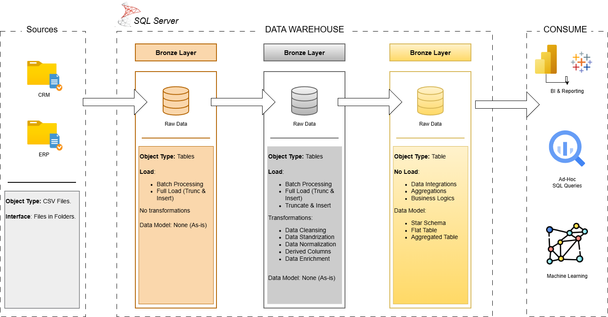

# 📌 Data Warehouse & Proyecto de Analítica – SQL Server

Bienvenido a mi Proyecto de Data Warehouse y Analítica 🚀  

Este proyecto demuestra el diseño e implementación de un Data Warehouse moderno utilizando SQL Server, siguiendo los principios de la Arquitectura Medallion (capas Bronze, Silver y Gold).

El objetivo de este proyecto de portafolio es evidenciar mi transición de Data Analyst a Data Engineer, aplicando procesos ETL, modelado de datos y generación de reportes analíticos orientados al negocio.

---

## 🏗 Arquitectura de Datos



El proyecto sigue el enfoque de Arquitectura Medallion:

### 🟤 Capa Bronze
Almacena datos crudos provenientes de sistemas ERP y CRM (archivos CSV) cargados en SQL Server sin transformaciones estructurales complejas.

### ⚪ Capa Silver
Aplica procesos de limpieza, estandarización y transformación para garantizar calidad, consistencia e integridad de los datos.

### 🟡 Capa Gold
Contiene datos listos para el negocio, modelados bajo un esquema dimensional (Star Schema) compuesto por tablas de hechos y dimensiones, optimizado para consultas analíticas y reporting.

---

## 📖 Descripción General del Proyecto

Este proyecto incluye:

- Diseño de una arquitectura de Data Warehouse escalable  
- Desarrollo de pipelines ETL en SQL  
- Implementación de validaciones de calidad de datos  
- Construcción de modelos dimensionales (Star Schema)  
- Desarrollo de reportes analíticos basados en SQL  

---

## 🎯 Enfoque Profesional

Este repositorio refleja mi experiencia y dirección profesional hacia:

- Desarrollo avanzado en SQL  
- Fundamentos sólidos en Data Engineering  
- Diseño y automatización de procesos ETL  
- Modelado dimensional (Star Schema)  
- Analítica orientada a la toma de decisiones  

---

## 🚀 Alcance del Proyecto

### Construcción del Data Warehouse

**Objetivo:**  
Desarrollar un Data Warehouse estructurado que consolide información de ventas y permita análisis estratégicos.

**Alcance funcional:**

- Ingesta de datos desde sistemas ERP y CRM (archivos CSV)  
- Limpieza y transformación de datos  
- Integración en un modelo analítico unificado  
- Enfoque en el dataset más reciente (sin historización)  
- Documentación clara para perfiles técnicos y de negocio  

---

### Analítica y Reportes

Se desarrollan análisis en SQL para generar insights sobre:

- Comportamiento de clientes  
- Desempeño de productos  
- Tendencias de ventas  

Estos análisis permiten respaldar decisiones basadas en datos dentro del área comercial.

---

## 📂 Estructura del Repositorio

```bash
data-warehouse-project/
│
├── datasets/
├── docs/
│   └── Arquitectura.png
├── scripts/
│   ├── bronze/
│   ├── silver/
│   └── gold/
├── tests/
├── README.md
├── LICENSE
└── .gitignore
```


---

## 👤 Sobre mí

Soy **Jordan Aramis**, Data Analyst con experiencia en diseño y automatización de procesos ETL, desarrollo en SQL y modelado de datos orientado a la toma de decisiones estratégicas.

Me especializo en estructuración de datos, optimización de consultas y construcción de soluciones analíticas robustas que garantizan calidad, consistencia e integridad de la información.

Actualmente me encuentro evolucionando hacia el rol de **Data Engineer**, enfocándome en:

- Diseño e implementación de Data Warehouses
- Modelado dimensional (Star Schema)
- Arquitecturas de datos escalables (Medallion Architecture)
- Orquestación y automatización de pipelines ETL
- Soluciones en la nube con Azure

📫 Email: jordanaramis97@gmail.com  
🔗 LinkedIn: https://www.linkedin.com/in/jordanaramis-data/  

---

## 🛡 Licencia

Este proyecto está bajo la licencia MIT.
